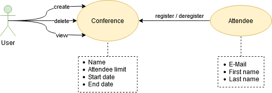

# Konfi
*Small application for small conferences.*

**The purpose of this repository is to show a legacy Java application, which then can be migrated to Kotlin. It is not meant to be used in production.**

## Domain

* Only one conference with a specific name at a time
* Maximal number of attendees cannot be exceeded
* Each attendee may register for a given conference only once

## Testing & running
Konfi can be tested and started by executing Gradle tasks:
* Test with `./gradlew backend:test`
* Run with `./gradlew backend:bootRun`

## Access points
* Backend-Server is running on http://localhost:8080
* REST-API is available via [Swagger](http://localhost:8080/swagger-ui/index.html)
* Database is available via [H2-Console](http://localhost:8080/h2) (use "jdbc:h2:mem:konfi" as JDBC-URL)